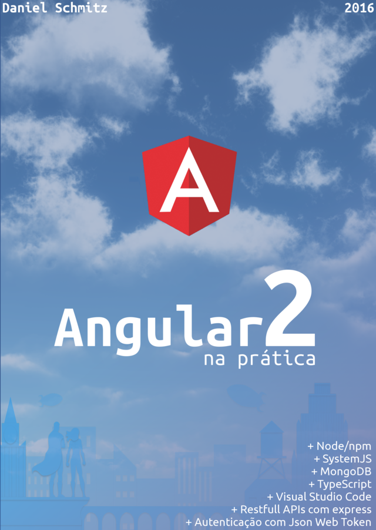

<h1>Angular2</h1>
<h2>Com Node/npm, Typescript, SystemJS e Visual Studio Code</h2>

Esta obra tem como objetivo apresentar o framework Angular, em sua nova versão, na qual foi totalmente reescrita. Quase todos os conceitos da versão 1 ficaram obsuletos e novas técnicas estão sendo utilizadas no Angular 2, com o objetivo de prover um framework mais dinâmico e moderno.

Antes de abordarmos o Angular 2 é necessário rever algumas tecnulogias que são vitais para o desenvulvimento de qualquer biblioteca utilizando HTML/Javascript. Primeiro, usaremos extensivamente o Node, que é uma forma de executar Javascript no servidor. O uso do Node será vital para que possamos manipular bibliotecas em nosso projeto, que serão instaladas através do gerenciador de pacotes do Node chamado npm.

<strong>1 - Introdução</strong>

<ul>
  <li>Pré requisitos</li>
  <ul>
    <li>Node</li>
    <li>Servidor web</li>
    <li>Arquivo package.json</li>
    <li>Erros ao instalar o Angular 2</li>
    <li>Arquivo package.json</li>
    <li>Editores de texto e IDEs</li>
  </ul>
  <li>Além do Javascript</li>
  <li>TypeScript</li>
  <li>Código fonte</li>
</ul>

<strong>2 - TypeScript1</strong>

<ul>
  <li>Instalando TypeScript</li>
  <li>Uso do Visual Studio Code</li>
  <ul>
    <li>Detectando alterações</li>
    <li>Debug no Visual Studio Code</li>
    <li>Debug no navegador</li>
  </ul>
  <li>Tipos</li>
  <ul>
    <li>Tipos Básicos</li>
    <li>Arrays</li>
    <li>Enum</li>
    <li>Any</li>
    <li>Void</li>
  </ul>
  <li>Classes</li>
  <ul>
    <li>Construtor</li>
    <li>Visibilidade de métodos e propriedades</li>
  </ul>
  <li>Herança</li>
  <li>Accessors (get/set)</li>
  <li>Métodos Estáticos</li>
  <li>Interfaces</li>
  <li>Funções</li>
  <ul>
    <li>Valor padrão</li>
    <li>Valor opcional</li>
  </ul>
  <li>Parâmetros Rest</li>
  <li>Parâmetros no formato JSON</li>
  <li>Módulos</li>
  <ul>
    <li>Exemplo com Systemjs</li>
    <li>Omitindo arquivos js e map no VSCode</li>
    <li>Uso do SystemJS</li>
  </ul>
  <li>Decorators (ou annotation)</li>
  <li>Conclusão</li>
</ul>

<strong>3 - Um pouco de prática </strong>

<ul>
  <li>Projeto AngularBase</li>
  <ul>
    <li>Configurando o projeto</li>
    <li>Erros ao instalar o Angular 2</li>
    <li>Configurando a compilação do TypeScript</li>
    <li>Criando o primeiro componente Angular 2</li>
    <li>Criando o bootstrap</li>
    <li>Criando o arquivo html</li>
  </ul>
  <li>Criando uma pequena playlist</li>
  <ul>
    <li>Estrutura inicial dos arquivos</li>
    <li>Criando um arquivo de configuração da aplicação</li>
    <li>Adicionando bootstrap</li>
    <li>Criando a classe Video</li>
    <li>Criando uma lista simples de vídeos</li>
    <li>Criando sub-componentes</li>
    <li>Formatando o template</li>
    <li>Repassando valores entre componentes</li>
    <li>Selecionando um vídeo</li>
    <li>Eventos</li>
    <li>Propagando eventos</li>
    <li>Exibindo os detalhes do vídeo</li>
    <li>Editando os dados do video selecionado</li>
    <li>Editando o título</li>
    <li>Criando um novo item</li>
    <li>Algumas considerações</li>
  </ul>
  <li>Criando Componentes</li>
  <li>Componentes Hierárquicos</li>
</ul>

<strong>4 - Um pouco de teoria</strong>

<ul>
  <li>Visão Geral</li>
  <li>Módulo (module)</li>
  <ul>
    <li>Library Module</li>
  </ul>
  <li>Componente (component)</li>
  <li>Template</li>
  <ul>
    <li>Interpulation (Uso de {{ }})</li>
    <li>Template Expressions</li>
  </ul>
  <li>Property Bind</li>
  <ul>
    <li>Laços</li>
    <li>Pipes (Operador |)</li>
  </ul>
  <li>Metadata (annotation)</li>
  <li>Serviço (Service)</li>
  <li>Injeção de dependência</li>
  <ul>
    <li>Uso do @Injectable()</li>
  </ul>
</ul>

<strong>5 - Formulários 8</strong>

<ul>
  <li>Criando o projeto inicial</li>
  <li>Uso do ngContrul</li>
  <li>Exibindo uma mensagem de erro</li>
  <li>Desabilitando o botão de submit do formulário</li>
  <li>Submit do formulário</li>
  <li>Contrulando a visibilidade do formulário</li>
</ul>

<strong>6 - Conexão com o servidor</strong>

<ul>
  <li>Criando o projeto</li>
  <li>Uso da classe Http</li>
  <li>Utilizando services</li>
  <li>Organização do projeto</li>
  <li>Model user</li>
  <li>Service user</li>
  <li>Alterando o componente AppComponent</li>
  <li>Enviando dados</li>
</ul>

<strong>7 - Routes</strong>

<ul>
  <li>Aplicação AngularRoutes</li>
  <li>Dividindo a aplicação em partes</li>
  <li>Criando a área onde os componentes serão carregados</li>
  <li>Configurando o router</li>
  <li>Criando links para as rotas</li>
  <li>Repassando parâmetros</li>
</ul>

<strong>8 - Exemplo Final - Servidor</strong>

<ul>
  <li>Criando o servidor RESTful</li>
  <li>O banco de dados MongoDB</li>
  <li>Criando o projeto</li>
  <li>Estrutura do projeto</li>
  <li>Configurando os modelos do MondoDB</li>
  <li>Configurando o servidor Express</li>
  <li>Testando o servidor</li>
  <li>Testando a api sem o Angular</li>
</ul>

<strong>9 - Exemplo Final - Cliente</strong>

<ul>
  <li>Arquivos iniciais</li>
  <li>Preparando o Template base da aplicação</li>
  <li>Implementando o roteamento (Router)</li>
  <ul>
    <li>Criando componentes</li>
    <li>Configurando o @RouteConfig</li>
    <li>Configurando o menu</li>
    <li>Configurando o router-outlet</li>
  </ul>
  <li>Exibindo Posts</li>
  <li>Login</li>
  <li>Services</li>
  <ul>
    <li>LoginService</li>
    <li>UserService</li>
    <li>HeadersService</li>
  </ul>
  <li>Conectando no servidor</li>
  <li>Posts</li>
  <ul>
    <li>PostService</li>
  </ul>
  <li>Refatorando a tela inicial</li>
  <li>Conclusão</li>
</ul>

<strong>10 - Utilizando Sublime Text</strong>

<ul>
  <li>Instalação</li>
  <li>Adicionando suporte a linguagem TypeScript</li>
  <li>Automatizando a build TypeScript</li>
</ul>

<strong>11 - Publicando a aplicação em um servidor cloud</strong>

<ul>
  <li>Criando a conta na Digital Ocean</li>
  <li>Criando o droplet (servidor)</li>
  <li>Configurando o acesso SSH</li>
  <li>Criando o usuário</li>
  <li>Instalando o git</li>
  <li>Instalando Node</li>
  <li>Instalando o nginx</li>
  <li>Instalando os módulos do node</li>
  <li>Recompilando os arquivos TypeScript</li>
  <li>Teste inicial</li>
  <li>Integração entre nginx e node</li>
  <li>Algumas considerações sobre node+nginx</li>
  <li>Domínio</li>
  <li>Conclusão</li>
</ul>

<h4><b>Aulas:</b> 📚 11 capítulos</h4>
<h4><b>Status do Curso:</b> :speech_balloon: Estudando</h4>
